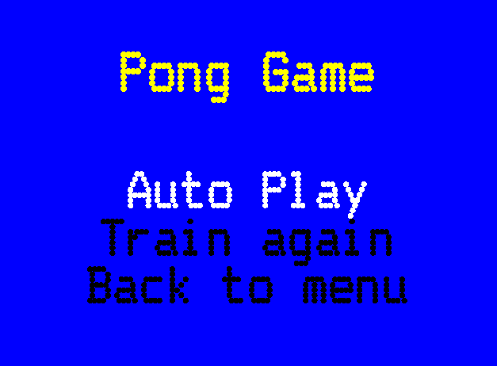
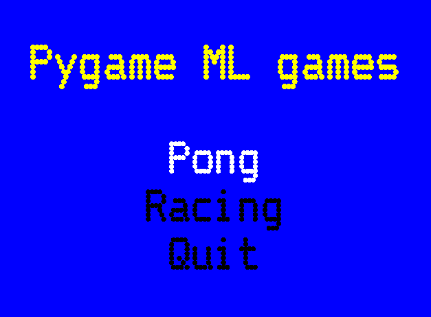

# ArcadeML
Machine Learning models learn how to play arcade games

## Description
This tool uses Machine Learning to play autonomously some little
arcade games. Before the algorithm is able to play autonomously, user
should train it by playing a few minutes to each game. This tool
doesn´t use raw pixels for making its predictions. Instead, it uses
internal game data: player position, ball position, obstacles
positions, etc.

## Example: Pong

- Left player is controlled by ML.
- Right player is an algorithmic player that just compares paddle
  position with ball position

* **Racing Game**

